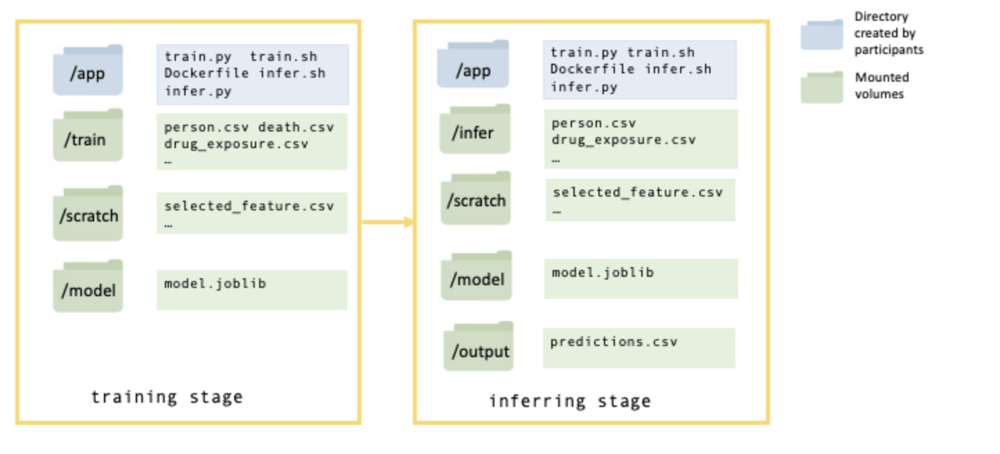

# EHR DREAM Challenge: Baseline Model
## Overview
This repository describes how to build and run locally the
baseline model of the [COVID-19 DREAM Challenge](https://www.synapse.org/#!Synapse:syn18404605). The goal of this [DREAM Challenge](http://dreamchallenges.org/) is to develop models that take as input the electronic health records (EHRs) of a patient and outputs the probability of this patient tested positive for COVID-19.

## Description of the model
This baseline model takes 15 features including clinical symptoms and vital signs. The baseline model refers to research conducted by Feng et al. [link](https://www.medrxiv.org/content/10.1101/2020.03.19.20039099v1)
This baseline model isn't trained on any real COVID patient data. Each patient is given a risk score based on the presence of the 15 features. A threshold of risk score is chosen basing on 10% test positive rate in Washington state. Patients whose risk score is above threshold are assigned test-positive probability as 1, otherwise 0 in

| Feature|OMOP concept-id|Domain|Threshold|
|-|-|-|-|
|age|year_of_birth|person|>55|
|temperature|3020891|measurement|>100.4F|
|heart rate|3027018|measurement|>100n/min|
|diastolic blood pressure|3012888|measurement|>85mmHg|
|systolic blood pressure|3004249|measurement|>140mmHg|
|hematocrit|3023314|measurement|>44|
|neutrophils|3013650|measurement|>8|
|lymphocytes|3004327|measurement|>9.5|
|oxygen saturation in artery blood|3016502|measurement|<94%|
|cough|R05(45606792)|condition|-|
|pain|R52.9(45544151)|condition|-|
|shortness of breath|R06.0(45558449)|condition|-|
|headache|R51(45558474)|condition|-|
|sore throat|R07.0(45592406)|condition|-|
|fatigue|R53.83(45534458)|condition|-|


## Dockerize the model

1. Clone this GitHub repository
2. `docker build -t docker.synapse.org/syn12345/my_model:v0.1 example/app`

## Run the baseline model locally on synthetic data
This section describes how to run the model locally, that is, without using the IT infrastructure of the [COVID_19 DREAM challenge](https://www.synapse.org/#!Synapse:syn18404605)(need updates).

### Description of the data
[Learn more about OMOP Synpuf data](https://www.synapse.org/#!Synapse:syn18405992/wiki/594233)(need updates)

### Download the data
[The Synpuf data are available here](https://www.synapse.org/#!Synapse:syn20685954). After downloading them, uncompress the archive and place the data folder where it can later be accessed by the dockerized model (see below).(need updates)

### Run the model locally on Synpuf data
Once the baseline model has been dockerized (see above), run the following command to train the model on Synpuf data:

```
docker run -v <path to data folder>:/data:ro
-v <path to scratch folder>:/scratch:rw
-v <path to output folder>:/output:rw
 docker.synapse.org/syn12345/my_model:v0.1 bash /app/COVID_baseline.sh
```

where

- `<path to data folder>` is the absolute path to the data (e.g. `/home/charlie/ehr_experiment/synpuf_data/data`).
- `<path to scratch folder>` is the absolute path to the scratch folder (e.g. `/home/charlie/ehr_experiment/scratch`).
- `<path to output folder>` is the absolute path to where the  the predictions will be exported (e.g. `/home/charlie/ehr_experiment/output`))


If the docker model runs successfully, the prediction file `predictions.csv` file will be created in the output folder. This file has two columns: 1) person_id and 2) test-positive probability. Note: make sure the column 2) contains no NA and the values are between 0 and 1.


## Build your own docker model  


## Preparation
We suggest EHR DREAM challenge participants to prepare a script: infer.py and a bashfile: infer.sh for running  infer.py.

*An example of script is:*
```
import pandas as pd
from joblib import load

input_df = pd.read_csv('/train/person.csv')
model = load('/model/baseline.joblib')
scores = model.predict_proba(input_df)[:,1]
output_df.to_csv( '/output/predictions.csv')

```


*An example of bashfile is:*
```
#!/usr/bin/env bash

python /app/train.py

```
*notice:* participants can also name their scripts differently as train.py and infer.py, and can have multiple scripts for the training and predicting purposes, but they will need to specify in the train.sh which scripts to run for training models and in the infer.sh which scripts to run for generating predictions.

## Docker container structure

A docker container is built basing on the docker images submitted by participants. The illustration below shows the structure of a docker container.




"app" directory is created by participants in which scripts for building prediction models (train.py), generating predictions (infer.py) and bashfiles to run those scripts (train.sh and infer.sh) live. Information to build "app" directory is in the dockerfile.

Other directories ("train","infer","scratch","model","output") will be mounted to the docker container by Synapse later. Participants don't need to create those directories but need to know the location of different directories in the container to access and store data.

Omop data inside "train" directory are provided to participants for building the models. Predictions are generated by applying models to omop data in the "infer" directory.  Omop data inside "train" and "infer" directories have the same tables and formats as synpuf data except there is no death.csv file  in "infer" directory."scratch" directory is used to store intermediate files(e.g. selected features)
"model" directory is used to store the model."output" directory is used to store the prediction generated from the "infer" omop data.


## Create a docker image
Put dockerfile, train.sh, train.py, infer.sh, infer.py in the same direcotory and run the command below:
```
docker build -t docker.synapse.org/syn12345/my_model:v0.1 <path to the dockerfile>
```
[Learn more about building docker images](https://docs.docker.com/get-started/)
## Submission to synapse platform
Log in Synapse
```
docker login -u <synapse username> -p <synapse password> docker.synapse.org
```
After logging in, view docker images and decide which ones to push into the registry.
```
docker images
#REPOSITORY                                 TAG                 IMAGE ID            CREATED             SIZE
#docker.synapse.org/syn12345/mytestrepo   version1            f8d79ba03c00        6 days ago          126.4 MB
#ubuntu                                     latest              f8d79ba03c00        6 days ago          126.4 MB
#docker.synapse.org/syn12345/my-repo	latest	df323sdf123d	2 days ago	200.3 MB
```
Push the docker image to Synapse platform.
```
docker push docker.synapse.org/syn12345/my_model:v0.1
```
[Learn more about submitting images to Synapse platform](https://docs.synapse.org/articles/docker.html)
